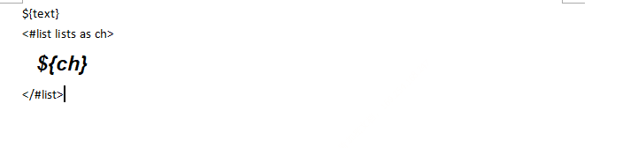
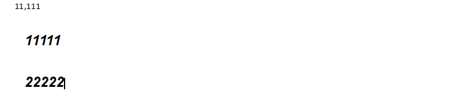

# myoffice

一个方便使用的office工具库。许多项目都试图在代码中去控制格式，复杂不说，效果也很难达到用户的需求。我们使用程序来操作word，更多的是想动态生成内容而已，试图用第三方程序来控制格式，个人感觉有点儿舍本逐末。因此本项目只将动态的内容填充到制作好的模板中去，格式由产品经经理等专业的人士去控制，力图达到效果与操作方便的中点。

## 工作方式

1. 在word中编辑好要格式，将需要动态填入的部分使用模板引擎表达式来表示。该项目默认使用`freemarker`，因此可以使用`freemarker`的语法。不仅仅是简单的变量替换，而是完整的表达式。如：if，循环。如：

   

2. 编辑好模板，剩下的就是调用api就可以了。

   ```java
   HashMap<String, Object> dataModel = new HashMap<>();
   dataModel.put("city", 11111);
   dataModel.put("text", 11111);
   dataModel.put("lists", new ArrayList<>(Arrays.asList("11111", "22222")));
   dataModel.put("bankName", 11111);
   dataModel.put("creditCode", 11111);
   dataModel.put("bankContactPhone", 11111);
   dataModel.put("bankAddress", 11111);
   TemplateFactory factory = new FreemarkerTemplateFactory();
   factory.findTemplate("e:/template/demot.docx").process("e:/template/demo.docx", dataModel);
   ```

   看看输出的结果：

   

   可以看到，使用方式非常的简单，并且保留了word中的格式。